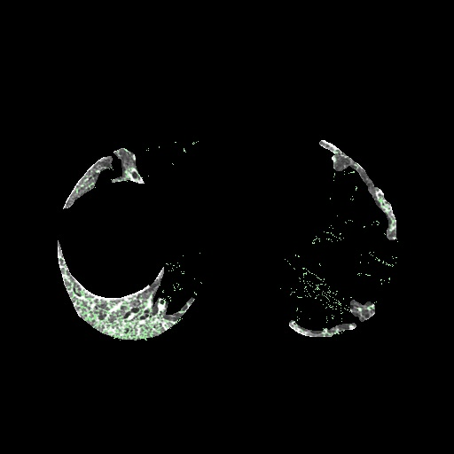
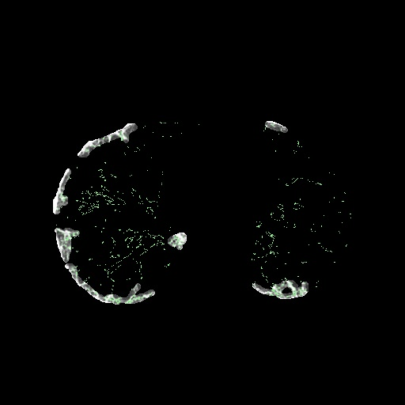

# 实验报告

518021910346 郭黛筠


我负责的部分为**使用纹理分析方法对提取肺实质的CT图像进行病灶区域进行分割**

## 预处理

在进行标准分割病灶获取灰度直方图和后续计算交并比的任务中，都需要将标注图与原图进行相关匹配

首先提取出标注图中相应颜色的部分作为mask，以黄色的网状病灶为例，将标注图转换为hsv模式，依据下表提取相应颜色。再将mask与原标注图结合获得含纹理的mask


```python
# 提取黄色
hsv = cv2.cvtColor(standard, cv2.COLOR_BGR2HSV)
low_hsv = np.array([26, 43, 46])
high_hsv = np.array([34, 255, 255])

mask = cv2.inRange(hsv, lowerb=low_hsv, upperb=high_hsv)

standard[mask == 0] = (0, 0, 0)
gray = cv2.cvtColor(standard, cv2.COLOR_BGR2GRAY)
cv2.imwrite(os.path.join(pretreat_path, filename), gray)
```

此时结果如下，可以发现有多余放缩水印，且受黄色标记影响，与原图相比，灰度并不一致


进一步去除左下角水印

```python
for i in range(row_size - 150, row_size):
    for j in range(200):
        mask[i][j] = 0
```

观察到标注图是原图的一部分，试图使用简单模板匹配

```python
def match(template, target):
    result = cv2.matchTemplate(target, template, cv2.TM_SQDIFF_NORMED)
    # 归一化处理
    cv2.normalize(result, result, 0, 1, cv2.NORM_MINMAX, -1)
    # 寻找矩阵中的最大值和最小值的匹配结果及其位置,
    # 在cv2.TM_SQDIFF_NORMED方法下, 值越小匹配度越高
    min_val, max_val, min_loc, max_loc = cv2.minMaxLoc(result)
    strmin_val = str(min_val)
    # min_loc：矩形定点, strmin_val：匹配值
    return min_loc, strmin_val
```

此时发现匹配有极大问题，检查发现标注图尺寸为1488\*1096，原图则为512\*512，因此使用更复杂的基于FLANN的特征匹配

```python
def match(template, target):
    MIN_MATCH_COUNT = 10  # 设置最低特征点匹配数量为10
    sift = cv2.SIFT_create()  # 创建sift检测器
    kp1, des1 = sift.detectAndCompute(template, None)
    kp2, des2 = sift.detectAndCompute(target, None)
    # 设置Flannde参数
    FLANN_INDEX_KDTREE = 0
    indexParams = dict(algorithm=FLANN_INDEX_KDTREE, trees=5)
    searchParams = dict(checks=50)
    flann = cv2.FlannBasedMatcher(indexParams, searchParams)
    matches = flann.knnMatch(des1, des2, k=2)
    
    good = []
    # 舍弃大于0.7的匹配
    for m, n in matches:
        if m.distance < 0.7 * n.distance:
            good.append(m)
    if len(good) > MIN_MATCH_COUNT:
        # 获取关键点的坐标
        src_pts = np.float32([kp1[m.queryIdx].pt for m in good]).reshape(-1, 1, 2)
        dst_pts = np.float32([kp2[m.trainIdx].pt for m in good]).reshape(-1, 1, 2)
        # 计算变换矩阵和MASK
        M, mask = cv2.findHomography(src_pts, dst_pts, cv2.RANSAC, 5.0)
        # matchesMask = mask.ravel().tolist()
        h, w = template.shape
        # 使用得到的变换矩阵对原图像的四个角进行变换，获得在目标图像上对应的坐标
        pts = np.float32([[0, 0], [0, h - 1], [w - 1, h - 1], [w - 1, 0]]).reshape(-1, 1, 2)
        dst = cv2.perspectiveTransform(pts, M)
        print(np.int32(dst))
        cv2.polylines(target, [np.int32(dst)], True, (255, 0, 0), 2, cv2.LINE_AA)
        return np.int32(dst)
    else:
        print("Not enough matches are found - %d/%d" % (len(good), MIN_MATCH_COUNT))
```

匹配结果如下，能够正确框选（右图白框）


因此可以使用匹配得来的矩形位置切割缩放原图及标注图，使其相合。输出发现坐标均为`[[[ 20  82]] [[ 20 428]] [[490 428]] [[490  82]]]`，即对应原图一个470\*346的区域

```python
# 缩小标注图
standard = cv2.resize(standard, [470, 346])

# 新建与origin对齐的mask
row_size, col_size = origin.shape[:2]
newmask = np.zeros(origin.shape, dtype=np.uint8)
for i in range(small_row_size - 1):
    for j in range(small_col_size - 1):
        newmask[i + 82][j + 20] = mask[i][j]

# 匹配原图        
origin[newmask == 0] = 0
cv2.imwrite(os.path.join(pretreat_path, originname), origin)
```

结果如下


**honey combing**同理，匹配坐标为`[[[ -9  60]] [[ -9 451]] [[520 451]] [[520  60]]]`，即529\*391，此时出现超出原图的部分，进行相关处理

```python
small_col_size = min(small_col_size, col_size)
for i in range(small_row_size - 1):
    for j in range(small_col_size - 1):
        newmask[i + 60][j] = mask[i][j + 9]  # honeycombing
```

至此图像预处理完成，将相关mask存至pretreat文件夹相应目录下


## 灰度直方图

将预处理后提取出的病灶蒙版生成灰度图，绘制直方图。

以**reticular**为例

```python
# 读取网状病灶
imgPath = os.path.join(reticular_path, filename)
img = cv2.imread(imgPath)
# 生成灰度图
gray = cv2.cvtColor(img, cv2.COLOR_BGR2GRAY)
# 生成直方图
plot = list(filter(lambda a: a != 0, gray.flatten()))
plt.hist(plot, bins=20)
plt.show()
```


对应绘制原图经过肺实质分割后的灰度直方图


对比观察可得，灰度值170到200区域主要由reticular病灶组成

因此取值170-200进行尝试，发现会有较多多余判定，当reticular占图片中大多区域时能较好识别，但占少数区域时会有较多假阳性误差，为直观起见，以提取出的标注掩膜为底，如下图，绿色标记原图中灰度值在[170,200]区间范围内

<center>


</center>
<center>图x.1号图（左）与20号图（右）对reticular的判定结果</center>

**honeycombing**同理

病灶蒙版生成灰度直方图


选用[60,100]获得如下图像，效果颇糟，有极大误判


<center>图x.1号图对honey combing的判定结果</center>


## 灰度共生矩阵


## 参考文献

[python+opencv 获取图片中指定颜色的部分_飞天土豆的博客-CSDN博客](https://blog.csdn.net/qq_40456669/article/details/93375709)

[opencv+python实现图像匹配----模板匹配、特征点匹配_GaoSimin-CSDN博客_python 模板匹配](https://blog.csdn.net/zhuisui_woxin/article/details/84400439)

