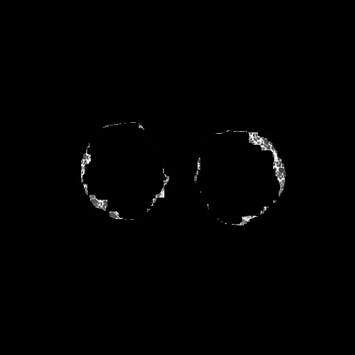
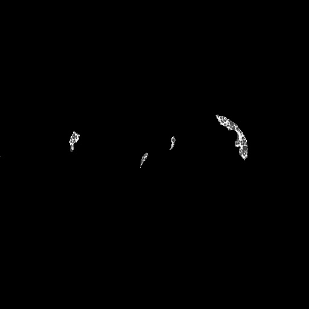
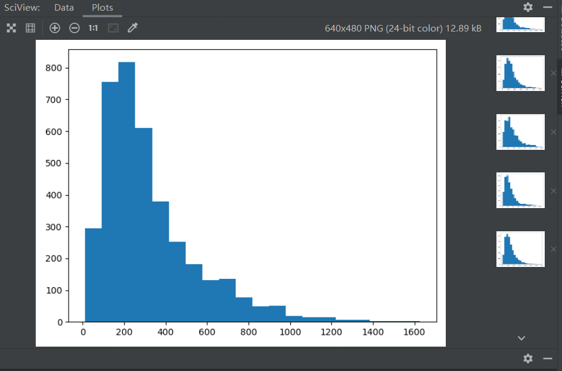
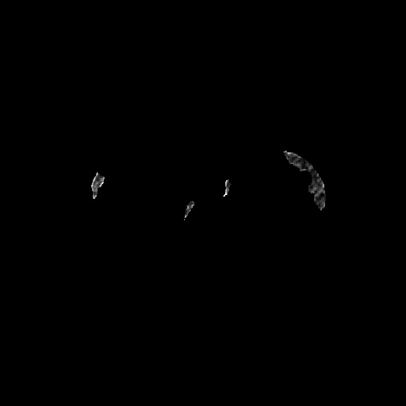

# 实验报告

518021910346 郭黛筠

前期部分由队友刘勉之同学完成**肺实质分割**，后期协助完成**调参**与**图片预处理**等工作

我负责的部分为**使用纹理分析方法对提取肺实质的CT图像进行病灶区域进行分割**，下述部分未特殊说明的即为个人完成部分

## 预处理

在进行标准分割病灶获取灰度直方图和后续计算交并比的任务中，都需要将标注图与原图进行相关匹配

首先提取出标注图中相应颜色的部分作为mask，以黄色的网状病灶为例，将标注图转换为hsv模式，依据下表提取相应颜色。再将mask与原标注图结合获得含纹理的mask


```python
# 提取黄色
hsv = cv2.cvtColor(standard, cv2.COLOR_BGR2HSV)
low_hsv = np.array([26, 43, 46])
high_hsv = np.array([34, 255, 255])

mask = cv2.inRange(hsv, lowerb=low_hsv, upperb=high_hsv)

standard[mask == 0] = (0, 0, 0)
gray = cv2.cvtColor(standard, cv2.COLOR_BGR2GRAY)
cv2.imwrite(os.path.join(pretreat_path, filename), gray)
```

此时结果如下，可以发现有多余放缩水印，且受黄色标记影响，与原图相比，灰度并不一致


进一步去除左下角水印

```python
for i in range(row_size - 150, row_size):
    for j in range(200):
        mask[i][j] = 0
```

观察到标注图是原图的一部分，试图使用简单模板匹配

```python
def match(template, target):
    result = cv2.matchTemplate(target, template, cv2.TM_SQDIFF_NORMED)
    # 归一化处理
    cv2.normalize(result, result, 0, 1, cv2.NORM_MINMAX, -1)
    # 寻找矩阵中的最大值和最小值的匹配结果及其位置,
    # 在cv2.TM_SQDIFF_NORMED方法下, 值越小匹配度越高
    min_val, max_val, min_loc, max_loc = cv2.minMaxLoc(result)
    strmin_val = str(min_val)
    # min_loc：矩形定点, strmin_val：匹配值
    return min_loc, strmin_val
```

此时发现匹配有极大问题，检查发现标注图尺寸为1488\*1096，原图则为512\*512，因此使用更复杂的基于FLANN的特征匹配

```python
def match(template, target):
    MIN_MATCH_COUNT = 10  # 设置最低特征点匹配数量为10
    sift = cv2.SIFT_create()  # 创建sift检测器
    kp1, des1 = sift.detectAndCompute(template, None)
    kp2, des2 = sift.detectAndCompute(target, None)
    # 设置Flannde参数
    FLANN_INDEX_KDTREE = 0
    indexParams = dict(algorithm=FLANN_INDEX_KDTREE, trees=5)
    searchParams = dict(checks=50)
    flann = cv2.FlannBasedMatcher(indexParams, searchParams)
    matches = flann.knnMatch(des1, des2, k=2)
    
    good = []
    # 舍弃大于0.7的匹配
    for m, n in matches:
        if m.distance < 0.7 * n.distance:
            good.append(m)
    if len(good) > MIN_MATCH_COUNT:
        # 获取关键点的坐标
        src_pts = np.float32([kp1[m.queryIdx].pt for m in good]).reshape(-1, 1, 2)
        dst_pts = np.float32([kp2[m.trainIdx].pt for m in good]).reshape(-1, 1, 2)
        # 计算变换矩阵和MASK
        M, mask = cv2.findHomography(src_pts, dst_pts, cv2.RANSAC, 5.0)
        # matchesMask = mask.ravel().tolist()
        h, w = template.shape
        # 使用得到的变换矩阵对原图像的四个角进行变换，获得在目标图像上对应的坐标
        pts = np.float32([[0, 0], [0, h - 1], [w - 1, h - 1], [w - 1, 0]]).reshape(-1, 1, 2)
        dst = cv2.perspectiveTransform(pts, M)
        print(np.int32(dst))
        cv2.polylines(target, [np.int32(dst)], True, (255, 0, 0), 2, cv2.LINE_AA)
        return np.int32(dst)
    else:
        print("Not enough matches are found - %d/%d" % (len(good), MIN_MATCH_COUNT))
```

匹配结果如下，能够正确框选（右图白框）


因此可以使用匹配得来的矩形位置切割缩放原图及标注图，使其相合。输出发现坐标均为`[[[ 20  82]] [[ 20 428]] [[490 428]] [[490  82]]]`，即对应原图一个470\*346的区域

```python
# 缩小标注图
standard = cv2.resize(standard, [470, 346])

# 新建与origin对齐的mask
row_size, col_size = origin.shape[:2]
newmask = np.zeros(origin.shape, dtype=np.uint8)
for i in range(small_row_size - 1):
    for j in range(small_col_size - 1):
        newmask[i + 82][j + 20] = mask[i][j]

# 匹配原图        
origin[newmask == 0] = 0
cv2.imwrite(os.path.join(pretreat_path, originname), origin)
```

结果如下


**honey combing**同理，匹配坐标为`[[[ -9  60]] [[ -9 451]] [[520 451]] [[520  60]]]`，即529\*391，此时出现超出原图的部分，进行相关处理

```python
small_col_size = min(small_col_size, col_size)
for i in range(small_row_size - 1):
    for j in range(small_col_size - 1):
        newmask[i + 60][j] = mask[i][j + 9]  # honeycombing
```

至此图像预处理完成，将相关mask存至pretreat文件夹相应目录下


## 灰度直方图

将预处理后提取出的病灶蒙版生成灰度图，绘制直方图。

以**reticular**为例

```python
# 读取网状病灶
imgPath = os.path.join(reticular_path, filename)
img = cv2.imread(imgPath)
# 生成灰度图
gray = cv2.cvtColor(img, cv2.COLOR_BGR2GRAY)
# 生成直方图
plot = list(filter(lambda a: a != 0, gray.flatten()))
plt.hist(plot, bins=20)
plt.show()
```


对应绘制原图经过肺实质分割后的灰度直方图


对比观察可得，灰度值170到200区域主要由reticular病灶组成

因此取值170-200进行尝试，发现会有较多多余判定，当reticular占图片中大多区域时能较好识别，但占少数区域时会有较多假阳性误差，为直观起见，以提取出的标注掩膜为底，如下图，绿色标记原图中灰度值在[170,200]区间范围内

<center>


</center>
<center>图x.1号图（左）与20号图（右）对reticular的判定结果</center>

**honeycombing**同理

病灶蒙版生成灰度直方图


选用[60,100]获得如下图像，效果颇糟，有极大误判


<center>图x.1号图灰度范围[60,100]对honey combing的判定结果</center>

但观察发现灰度值高的地方主要集中在honey combing和reticular处，采用范围[200,255]有更好的效果


<center>图x.1号图灰度范围[200,255]对honey combing的判定结果</center>


## 灰度共生矩阵

灰度共生矩阵被定义为从灰度为i的像素点出发，某个固定距离的上的点灰度值为j的概率，即，所有估计的值可以表示成一个矩阵的形式，以此被称为灰度共生矩阵。通过灰度共生矩阵能够计算出一些统计量作为纹理分类的特征

### 构建灰度共生矩阵

在图像中任意一点（x,y）及偏离它的一点(x+a,y+b)（其中a，b为整数）构成点对。设该点对的灰度值为(f1,f2)，统计整幅图像中各(f1,f2)出现的次数，然后排列成一个方阵，再用(f1,f2)出现的总次数将它们归一化为出现的概率P(f1,f2)，由此产生的矩阵为灰度共生矩阵。

ab的合理取值受纹理大小影响，此处由于honey combing和reticular纹理均较为细致，因此ab取值应该较小

为避免过于繁琐的计算，先减小灰度级数，其中max_gray_level是原图中最大灰度级

```python
# 减小灰度级数
if max_gray_level > gray_level:
    for j in range(height):
        for i in range(width):
            img[j][i] = img[j][i] * gray_level / max_gray_level
```

再进行相关计算

```python
# 计算共生矩阵
for j in range(height - dy):
    for i in range(width - dx):
        x = img[j][i]
        y = img[j + dy][i + dx]
        ans[x][y] += 1
```

并将之归一化即转为频率，除此之外归一化也避免了后续计算溢出等

```python
sum = (height - dy) * (width - dx)
for i in range(gray_level):
    for j in range(gray_level):
        ans[i][j] = ans[i][j] / sum
```

便得到了灰度共生矩阵ans

### 计算特征值

+ **对比度**

  度量 矩阵的值是如何分布和图像中局部变化的多少，反应了图像的清晰度和纹理的沟纹深浅。纹理的沟纹越深，反差越大，效果越清晰；反之，对比值小，则沟纹浅，效果模糊。
  $$
  Con=\sum_{i} \sum_j (i-j)^2P(i,j)
  $$
  
+ **能量**

  能量变换反映了图像灰度分布均匀程度和纹理粗细度。若灰度共生矩阵的元素值相近，则能量较小，表示纹理细致；若其中一些值大，而其它值小，则能量值较大。能量值大表明一种较均一和规则变化的纹理模式。
  $$
  Asm=\sum_i\sum_jP(i,j)^2
  $$
  
+ **熵**

  图像包含信息量的随机性度量。当共生矩阵中所有值均相等或者像素值表现出最大的随机性时，熵最大；因此熵值表明了图像灰度分布的复杂程度，熵值越大，图像越复杂。
  $$
  Ent=-\sum_i\sum_jP(i,j) \log P(i,j)
  $$
  
+ **逆方差**

  逆方差反映了图像纹理局部变化的大小，若图像纹理的不同区域间较均匀，变化缓慢，逆方差会较大，反之较小。
  $$
  H=\sum_i^{N-1}\sum_j^{N-1} \frac{P(i,j|d,\theta)}{1+(i-j)^2}
  $$

代码如下

```python
for i in range(gray_level):
    for j in range(gray_level):
        contrast += (i - j) * (i - j) * m[i][j]
        energy += int(m[i][j] * m[i][j])
        homogeneity += m[i][j] / (1 + (i - j) * (i - j))
        if m[i][j] > 0.0:
            entropy += m[i][j] * math.log(m[i][j])
```

### 绘制对应图像

在掩膜图上滑动小窗口计算共生矩阵和特征值，为提高计算效率，仅计算以灰度值不为0的像素为中心的小窗口，小窗口设置为7\*7的大小，方向设为(2,2)

各窗口的特征值存储在中心位置，将该矩阵值作为灰度进行相关放缩后绘制

观察发现此时四种特征值的效果均不是特别好但勉强可区分

以对比度及能量为例，病灶处及其周围无明显区别，且中部有较多噪声，运行速度也很慢

<center>


</center>
<center>图x.蜂窝1号图对比度（左）与能量（右）绘制结果</center>

但同时可以观察到中间部分与周边病灶有较明显的分界感，因此提出先刨除大连通域的设想，交由另一位组员实现

对比初步刨除后的图与标记图可发现，此时剩下的多出来可能被误判的与蜂窝病灶在灰度上有较明显的差别

<center>


</center>
<center>图x.蜂窝1号图初步删除大连通域（左）与对应标记图（右）</center>

绘制标记图的灰度共生矩阵对比度项所生成的直方图，并以$(0,1500)\rightarrow(0,255)$的映射绘制成图

<center>


</center>
<center>图x.蜂窝1号标记图对比度直方图（左）与对应映射成图（右）</center>

观察可以发现对比度大多处于（100，400）之间

而经过初步删除大连通域的原始图绘制的直方图如下


对比可以发现与标记图相比在200左右值数明显偏少，700以上虚高

为避免空洞被挖除，优化GLCM的实现，不再以1为步长滑动，而是以窗口大小滑动

对各特征值进行参数调整和尝试，该部分调参后续由队友接手

**网状**部分由本人调参，综合考虑参数为使用熵计算，window_size为（5，5），方向（0，1）

选取（-11，0）范围，preprocess调参 size阈值250 ，闭操作5开操作4

在此参数下标注图如下


最终结果如下


### 最终结果

##### 网状病灶：

平均交并比为：**0.4291653869184649**

其中**0300001.jpg** 文件夹的交并比最大，为： **0.5760820775889708**

##### 蜂巢病灶：

平均交并比为：**0.55491045661917**

其中**1700001.jpg** 文件夹的交并比最大，为： **0.6477442983186282**


### 实验分析
在此过程中发现部分白色长条病灶易于网状病灶混淆，大致原因为灰度均值等区别不够明显，且特征值会混在一起，可以考虑采用多个特征值及方向等同时筛选，或使用相似性计算与标注图比较来进行处理，由于时间关系来不及实现

同时网状病灶通常分布在脉络不清的整块边界内，容易被忽视，不易计算共生矩阵


## 参考文献

[python+opencv 获取图片中指定颜色的部分_飞天土豆的博客-CSDN博客](https://blog.csdn.net/qq_40456669/article/details/93375709)

[opencv+python实现图像匹配----模板匹配、特征点匹配_GaoSimin-CSDN博客_python 模板匹配](https://blog.csdn.net/zhuisui_woxin/article/details/84400439)

[[图像纹理——灰度共生矩阵_sunny的专栏-CSDN博客_灰度共生矩阵](https://blog.csdn.net/guanyuqiu/article/details/53117507)](https://blog.csdn.net/qq_36654309/article/details/106527876?utm_medium=distribute.pc_relevant.none-task-blog-baidujs_baidulandingword-4&spm=1001.2101.3001.4242)


